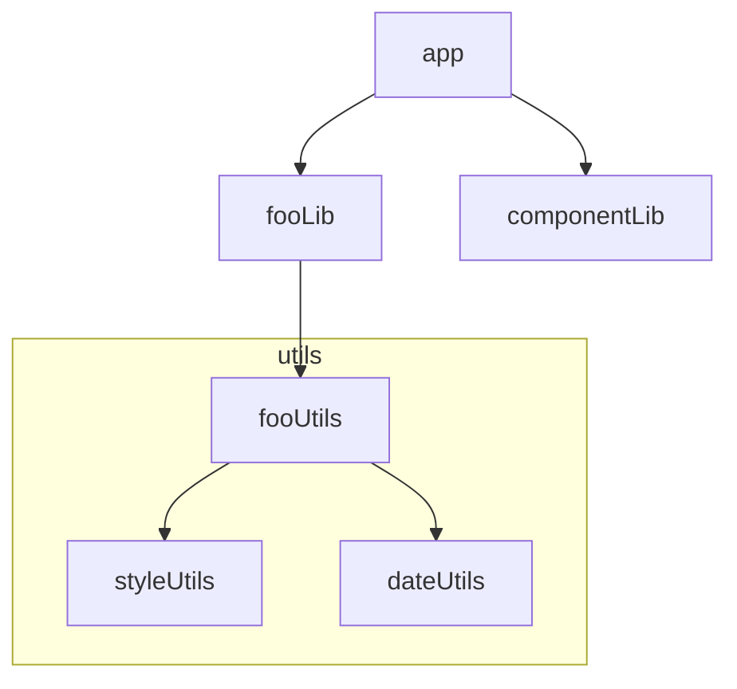
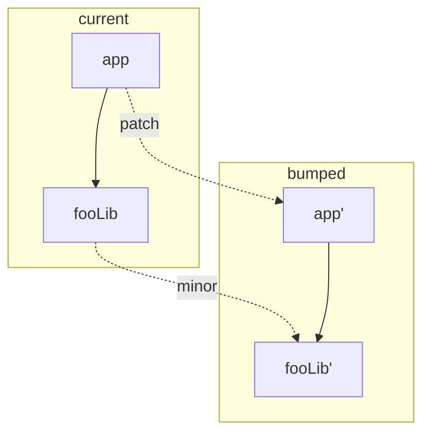
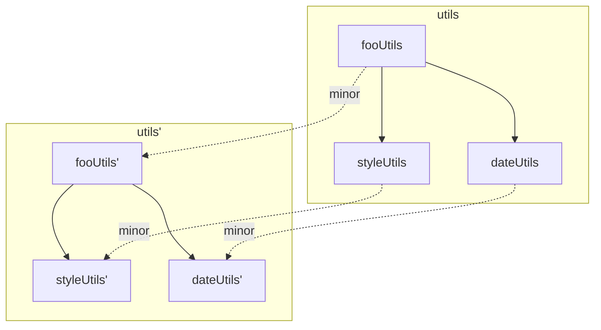

# Bump Algorithm

Bumping a single package is a simple task of just looking up a change file for its change type and using semver to bump the version according to what that change type is.

Things get a bit more complicated when we introduce the concepts of version groups and dependent package bumping. For sake of description of this algorithm, we'll can take look at the following graph:



### Dependent Version Bumping

In the above example, the `app` package is dependent on `fooLib`. Let's assume that the developer has created a `minor` change inside `fooLib`. By default, `beachball` will also bump `app` with a `patch` change type, like this:



To modify what the dependent package bumped change type would be (e.g. making `app` also bump with `minor` in the above example), you have to modify the change file to specify this. Here's an example of a change file under `/changes`:

```diff
{
  "comment": "Upgrading fooLib",
  "type": "patch",
  "packageName": "fooLib",
  "email": "me@me.me",
  "commit": "b785112c03f063b71d936ff052470817019267d4",
  "date": "2019-06-20T22:54:59.172Z",
+ "dependentChangeType": "minor"
}
```

### Grouped Bumping

In the above example, `fooUtils`, `styleUtils`, `dateUtils` all belong to a `utils` group. Whenever one of those packages get bumped, the entire group would get bumped by the same change type. We can illustrate it like so:



> NOTE: the group get bumped together even if it is part of a dependent package bump. In other words, package bumps propagate its changes via dependent package bump as well as group package bumps
