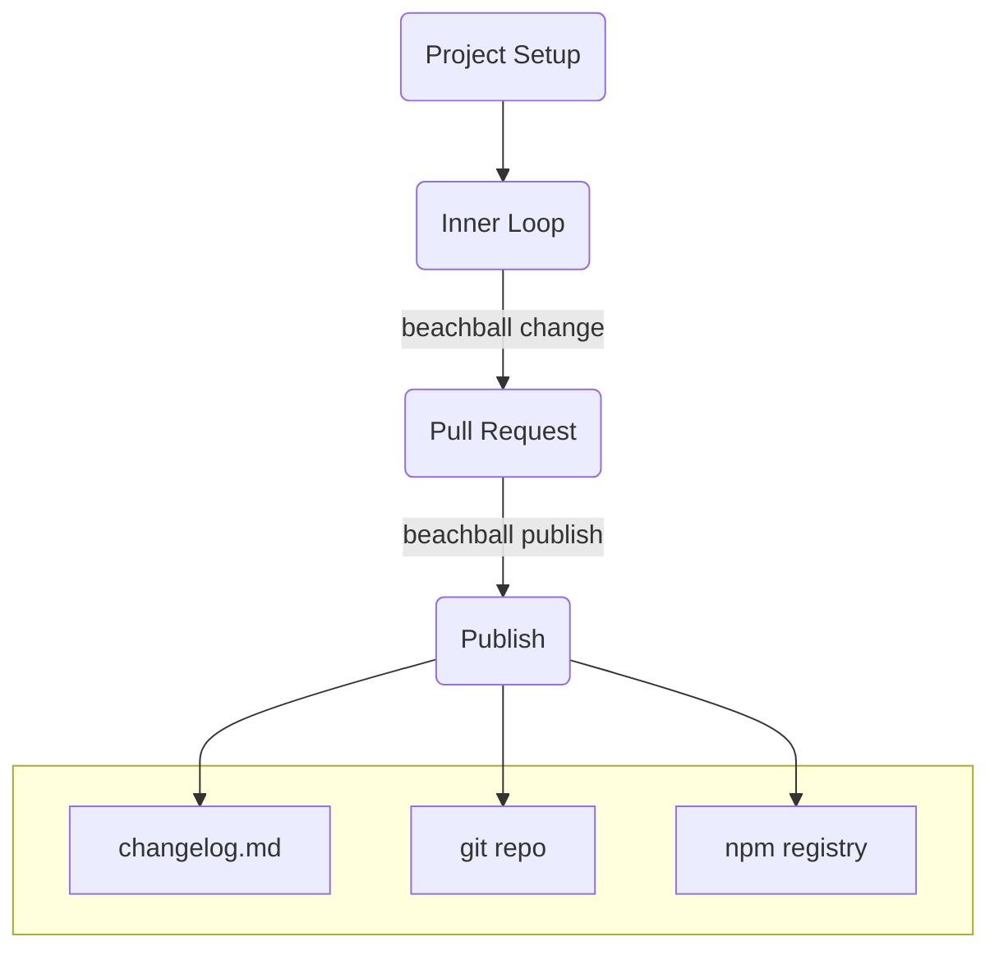

---
tags:
  - overview
category: doc
---

# Getting started

## Why Beachball?

The JavaScript ecosystem moves fast. One reason that this ecosystem is so vibrant and agile is its ability to share code via npm packages. Developers publishing npm packages have to keep track of what's changed in their code to determine how to bump versions, then make sure the versions in their git repo stay in sync with the npm registry...what a hassle!

`beachball` helps streamline this process. As developers make PRs, it helps track the types and details of changes being made. Then when it's time to publish a new version, `beachball` automates publishing version bumps to npm, generating changelogs, and syncing changes back to the git repo.

## Beachball workflow

`beachball` fits into your workflow without any extra configuration (by default).

For the workflow, a ~~picture~~ diagram is worth a thousand words, so here it is:

**Inner loop:** When you've made some commits to your branch, simply run [`beachball change`](../cli/change) to generate change files.

**Pull request:** The PR build runs [`beachball check`](../cli/check) to verify change files are included. Your colleagues can review the change file description and type, and easily propose changes if needed. The PR with change files then gets merged to the target branch (e.g. `main`).

**Publish:** When it's time to release, [`beachball publish`](../cli/publish) is either called [by a continuous integration (CI) system](../concepts/ci-integration) or manually by a developer. This does three things:

1. All change files are deleted
2. Versions are bumped, checked in locally and pushed remotely
3. npm packages are published to a public or private registry

At that point, your repo is ready for the next change!

## Next steps

- [Install `beachball`](./installation)
- [Learn more about change files](../concepts/change-files)
- [Set up CI integration](../concepts/ci-integration)
