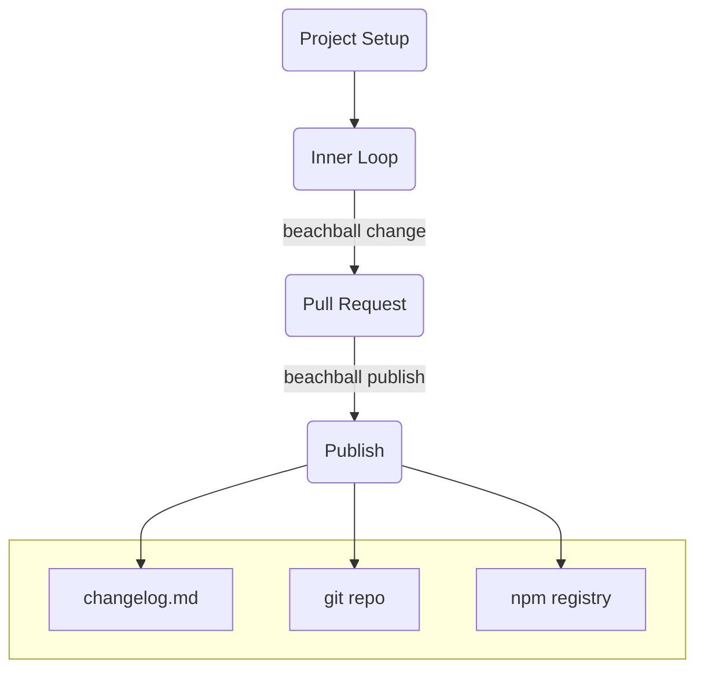

---
tags:
  - overview
category: doc
---

# Getting Started

## Why Beachball?

The JavaScript ecosystem moves fast. One reason that this particular ecosystem is so vibrant and agile is in its ability to share code via npm packages. This has led to an explosion of versions of packages in the public npm registry, as well as private npm registries within companies. Developers also have to keep their git repos in sync with the npm registry versions... what a hassle!

`beachball` helps with the process of tracking changes as developers make PRs, then when it's time to release, publishing version bumps to npm and syncing changes back to the git repo.

## Beachball workflow

First off, a ~~picture~~ diagram is worth a thousand words, so here it is:

`beachball` fits into your workflow without any extra configuration (by default).

**Inner loop:** When you have made some commits to your branch, simply run `beachball change` to generate change files.

**Pull request:** During PR review and feedback loops, your colleagues might remind you to modify your change file descriptions or change type. This then gets merged to the target branch (e.g. `main`).

**Publish:** When it's time to release, `beachball publish` is either called by a continuous integration (CI) system or manually by a developer. This does three things:

1. All change files are deleted
2. Versions are bumped, checked in locally and pushed remotely
3. npm packages are published to a public or private registry

At that point, your repo is ready for the next change!

## Next steps

- [Install `beachball`](./installation)
- [Learn more about change files](../concepts/change-files)
- [Set up CI integration](../concepts/ci-integration)
